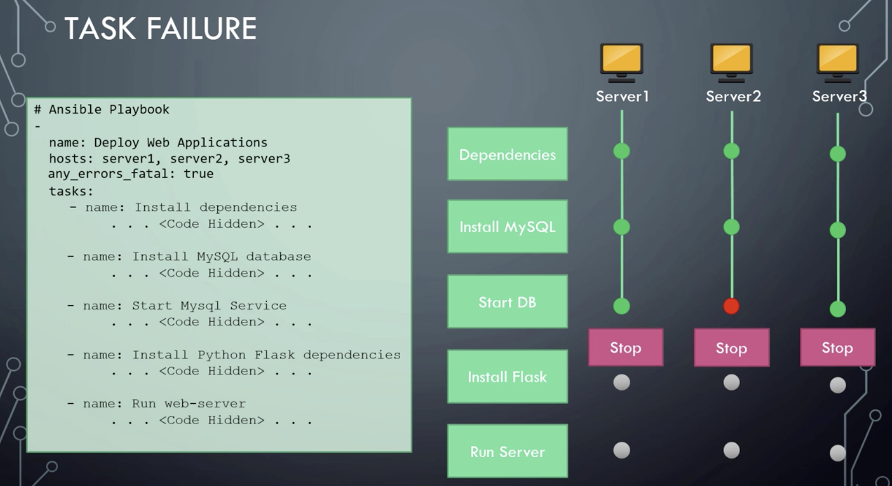

# Error handling


- ignore_errorrs - Ignore Errors
- failed_when - Fail on a condition -example:

```
- command: cat/var/log/server.log
  register: command_output
  failed_when: "'Error' in command_output.stdout"
```
By default if  one task(step) is failure during performing playbook ansible exit a playbook


Stop playbook on all hosts in case of failure on the one:



